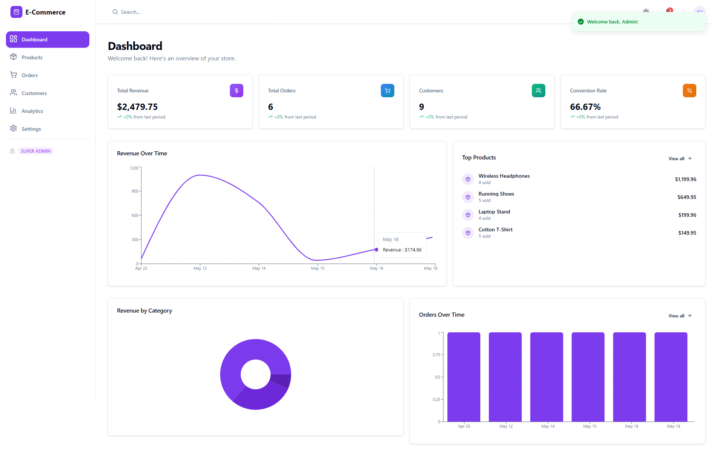
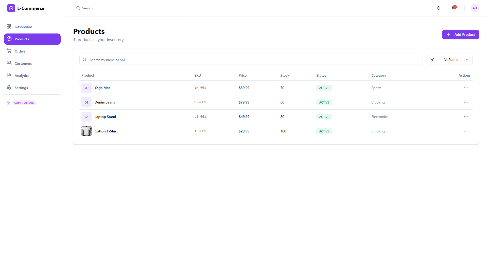
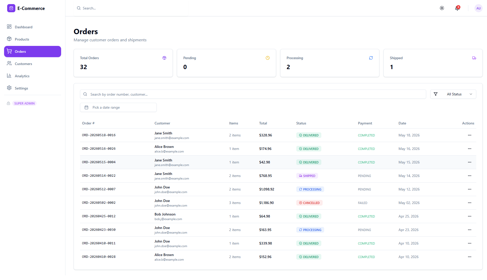
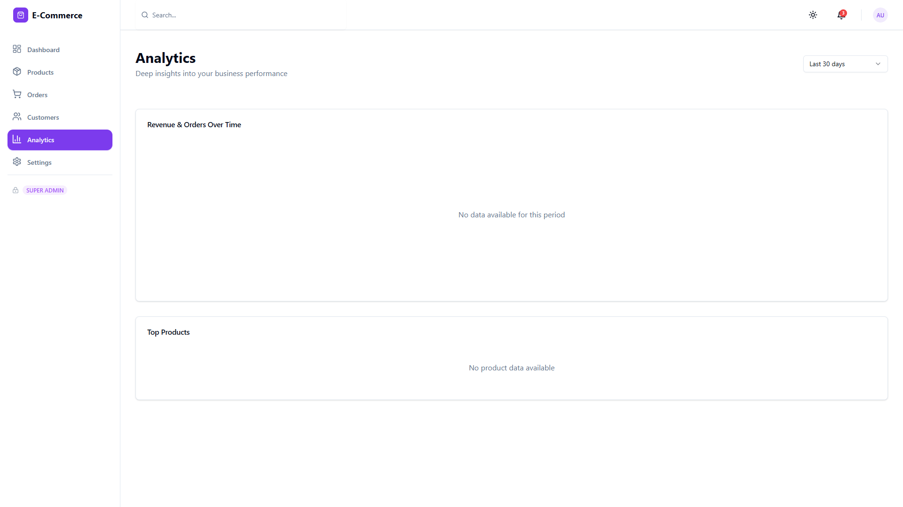
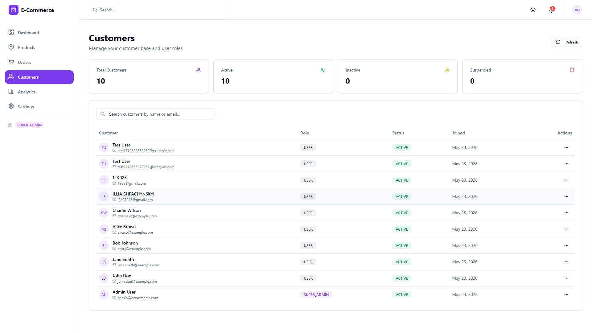

# 🛍️ Modern E-Commerce Dashboard

A production-ready, full-stack e-commerce admin dashboard built with modern technologies and best practices.


## 📸 Screenshots

### Dashboard Overview

*Real-time analytics with revenue tracking, order statistics, and performance metrics*

### Product Management

*Full CRUD operations with advanced search, filters, and bulk actions*

### Order Management

*Track orders, update statuses, and manage customer shipments*

### Analytics

*Deep insights with interactive charts and top product performance*

### Customer Management

*Manage users, roles, and customer accounts*

## 🚀 Features

### 📊 **Advanced Analytics Dashboard**
- Real-time revenue tracking
- Sales analytics with interactive charts
- Conversion metrics and KPIs
- Dynamic date filters
- Animated widgets with Framer Motion

### 📦 **Product Management**
- Full CRUD operations
- Bulk actions (update, delete)
- Advanced search and filters
- Image upload and gallery
- Stock tracking and alerts
- Category management

### 🛒 **Order Management**
- Order tracking and status updates
- Payment processing
- Invoice generation
- Customer order history
- Real-time notifications

### 👥 **User & Role Management**
- RBAC (Role-Based Access Control)
- Admin, Manager, User roles
- User activity tracking
- Account management
- Audit logs

### 🔐 **Authentication & Security**
- JWT access/refresh tokens
- Secure HTTP-only cookies
- Password hashing with bcrypt
- Protected routes
- Rate limiting
- Helmet security headers
- CORS configuration

### 🎨 **Modern UI/UX**
- Premium SaaS design
- Dark/Light theme
- Responsive mobile-first layout
- Smooth animations
- Skeleton loaders
- Toast notifications
- Accessible components

## 🛠️ Tech Stack

### **Frontend**
- **React 18** - UI library
- **TypeScript** - Type safety
- **Vite** - Build tool
- **TailwindCSS** - Styling
- **Shadcn/ui** - Component library
- **React Query** - Server state management
- **Zustand** - Client state management
- **React Router** - Routing
- **Framer Motion** - Animations
- **Recharts** - Data visualization
- **React Hook Form** - Form handling
- **Zod** - Schema validation

### **Backend**
- **Node.js** - Runtime
- **Express.js** - Web framework
- **TypeScript** - Type safety
- **PostgreSQL** - Database
- **Prisma ORM** - Database toolkit
- **JWT** - Authentication
- **Bcrypt** - Password hashing
- **Zod** - Validation
- **Winston** - Logging
- **Helmet** - Security

### **DevOps**
- **Docker** - Containerization
- **Docker Compose** - Multi-container orchestration
- **Nginx** - Reverse proxy
- **GitHub Actions** - CI/CD
- **PostgreSQL** - Production database

## 📁 Project Structure

```
Modern-Ecommerce-Dashboard/
├── apps/
│   ├── backend/              # Node.js + Express API
│   │   ├── src/
│   │   │   ├── modules/      # Feature modules
│   │   │   ├── common/       # Shared utilities
│   │   │   ├── config/       # Configuration
│   │   │   └── database/     # Prisma schema & migrations
│   │   └── package.json
│   │
│   └── frontend/             # React + Vite app
│       ├── src/
│       │   ├── features/     # Feature modules
│       │   ├── shared/       # Shared components & utils
│       │   ├── store/        # Global state
│       │   └── router/       # Routing
│       └── package.json
│
├── docker/                   # Docker configs
├── .github/workflows/        # CI/CD pipelines
├── docker-compose.yml
└── package.json
```

## 🚀 Getting Started

### Prerequisites

- Node.js 20.x or higher
- PostgreSQL 16.x
- Docker & Docker Compose (optional)

### Installation

1. **Clone the repository**
```bash
git clone https://github.com/yourusername/modern-ecommerce-dashboard.git
cd modern-ecommerce-dashboard
```

2. **Install dependencies**
```bash
npm install
```

3. **Setup environment variables**

Backend:
```bash
cd apps/backend
cp .env.example .env
# Edit .env with your configuration
```

Frontend:
```bash
cd apps/frontend
cp .env.example .env
# Edit .env with your configuration
```

4. **Setup database**
```bash
cd apps/backend
npx prisma generate
npx prisma migrate dev
npx prisma db seed
```

5. **Start development servers**
```bash
# From root directory
npm run dev
```

Backend: http://localhost:5000
Frontend: http://localhost:3000

### Using Docker

```bash
# Development
docker-compose up -d

# Production
docker-compose -f docker-compose.prod.yml up -d
```

## 📝 Default Credentials

```
Email: admin@ecommerce.com
Password: Admin@123
```

## 🧪 Testing

```bash
# Backend tests
cd apps/backend
npm test

# Frontend type check
cd apps/frontend
npm run type-check
```

## 📦 Building for Production

```bash
# Build all
npm run build

# Build backend only
npm run build:backend

# Build frontend only
npm run build:frontend
```

## 🚢 Deployment

### Manual Deployment

1. Build Docker images
2. Push to registry
3. Deploy to server
4. Run migrations
5. Start containers

### Automated Deployment (GitHub Actions)

Push to `main` branch triggers automatic deployment.

## 📊 API Documentation

API runs on `http://localhost:5000/api/v1`

### Endpoints

- `POST /auth/register` - Register new user
- `POST /auth/login` - Login
- `POST /auth/refresh` - Refresh token
- `GET /auth/me` - Get current user
- `GET /products` - Get products
- `POST /products` - Create product
- `GET /orders` - Get orders
- `GET /analytics/dashboard` - Get dashboard stats

Full API documentation: [API.md](./docs/API.md)

## 🏗️ Architecture

This project follows:
- **Feature-based architecture** - Organized by features, not layers
- **Layered architecture** - Controller → Service → Repository
- **SOLID principles** - Clean, maintainable code
- **Type-safe** - End-to-end TypeScript
- **API-first** - RESTful API design

## 🔒 Security

- JWT authentication with refresh tokens
- HTTP-only secure cookies
- Password hashing with bcrypt (12 rounds)
- Rate limiting on API endpoints
- Helmet security headers
- CORS configuration
- Input validation with Zod
- SQL injection protection (Prisma)
- XSS protection

## 🎯 Performance

- Lazy loading
- Code splitting
- Image optimization
- Database indexing
- Query optimization
- Caching strategies
- Bundle optimization
- Gzip compression

## 📈 Monitoring & Logging

- Winston logging
- Error tracking
- Performance monitoring
- Health checks
- Audit logs

## 🤝 Contributing

1. Fork the repository
2. Create your feature branch (`git checkout -b feature/AmazingFeature`)
3. Commit your changes (`git commit -m 'Add some AmazingFeature'`)
4. Push to the branch (`git push origin feature/AmazingFeature`)
5. Open a Pull Request

## 📄 License

This project is licensed under the MIT License.

## 👨‍💻 Author

**Your Name**
- Portfolio: [yourportfolio.com](https://yourportfolio.com)
- LinkedIn: [linkedin.com/in/yourprofile](https://linkedin.com/in/yourprofile)
- GitHub: [@yourusername](https://github.com/yourusername)

## 🙏 Acknowledgments

- Shadcn/ui for the beautiful component library
- Vercel for inspiration
- The open-source community

---

**⭐ If you find this project useful, please consider giving it a star!**
